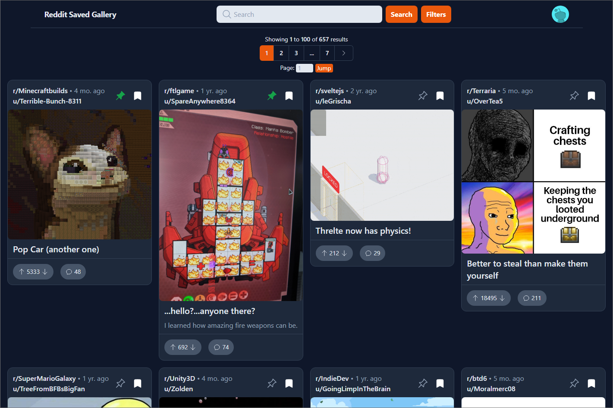
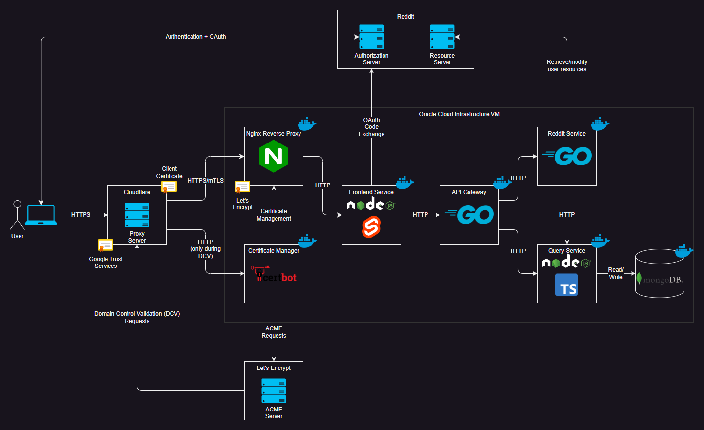

# Reddit Saved Gallery

[](https://github.com/Ke126/reddit-saved-gallery/actions/workflows/ci.yaml)
[](https://github.com/Ke126/reddit-saved-gallery/actions/workflows/deploy.yaml)



[Reddit Saved Gallery](https://savedgallery.net) is a SaaS web application allowing users to import, archive, view, and manage their saved posts and media on Reddit.

This repository contains all the necessary services to host Reddit Saved Gallery. For quick start instructions to run Reddit Saved Gallery locally, see [Getting started](#getting-started). For full deployment instructions to a production server, see [Deploying to production](#deploying-to-production).

For more details about the application, including some background on its architecture and design, check out [Reddit Saved Gallery: A Scalable Web Application](https://www.linkedin.com/pulse/reddit-saved-gallery-scalable-web-application-kevin-chen-vztde/) on LinkedIn.



## Table of contents

- [Features](#features)
- [Getting started](#getting-started)
    - [Create a Reddit app](#create-a-reddit-app)
    - [Set up Docker Compose](#set-up-docker-compose)
    - [Run the app](#run-the-app)
- [Deploying to production](#deploying-to-production)
    - [Obtain a domain](#obtain-a-domain)
    - [Create a (production) Reddit app](#create-a-production-reddit-app)
    - [Set up the production server](#set-up-the-production-server)
    - [Create GitHub secrets](#create-github-secrets)
    - [Deployment](#deployment)
- [Roadmap](#roadmap)
    - [Website features](#website-features)
    - [Other improvements](#other-improvements)

## Features

- Integrate directly with your Reddit account via OAuth; no external sign up required!
- Import, save, and unsave posts directly to and from Reddit
- Advanced querying options by title, author, subreddit, selftext, and more
- GitHub Actions CI/CD pipeline for automating testing, building, and deploying the application to production
- Automated TLS certificate management with Certbot and the Let's Encrypt CA
- mTLS with a Cloudflare WAF and proxy
- Multi-platform Docker images supporting linux/amd64 and linux/arm64 architectures
- Local hosting options!

## Getting started

The best way to run Reddit Saved Gallery locally is by using Docker. You must have Docker and Docker Compose installed on your machine.

### Create a Reddit app

You will need to create your own app on Reddit in order to obtain an OAuth2 `client ID` and `client secret`.

Go to https://www.reddit.com/prefs/apps and create an app. You may name it whatever you like. Make sure you have selected `web app`, and have set the `redirect uri` field to `http://localhost:3000/callback`.

Take note of your `client ID` and `client secret`, as these will be needed later.

### Set up Docker Compose

Download the [compose.yaml](./compose.yaml) file, either by copying its contents directly from this repository, or by running:
```bash
curl https://raw.githubusercontent.com/Ke126/reddit-saved-gallery/refs/heads/main/compose.yaml > ./compose.yaml
```

Create an `.env` file in the same directory as your `compose.yaml` file with the following required environment variables:

| Key                        | Description                           |
| -------------------------- | ------------------------------------- |
| OAUTH_CLIENT_ID            | The client ID for your Reddit app     |
| OAUTH_CLIENT_SECRET        | The client secret for your Reddit app |
| MONGO_INITDB_ROOT_USERNAME | The username used for MongoDB         |
| MONGO_INITDB_ROOT_PASSWORD | The password used for MongoDB         |

### Run the app

With everything set up, running Reddit Saved Gallery locally is as simple as running:
```bash
docker compose up -d
```

Visit http://localhost:3000 to use Reddit Saved Gallery in your browser!

To stop the application, simply run:
```bash
docker compose down
```

## Deploying to production

> [!NOTE]
> These instructions are only applicable for full deployment of Reddit Saved Gallery to a production server. For running the application locally, see [Getting started](#getting-started).

This repository already comes configured with various GitHub Actions workflows to automate testing, building, and deploying Reddit Saved Gallery to a production server. Only a few things need to be configured to automate this process and remotely run the application on the production server.

### Obtain a domain

Ensure that you own a valid domain name, and that there exists a DNS A type record pointing to the ip address of your production server.

### Create a (production) Reddit app

Follow the instructions in [Create a Reddit app](#create-a-reddit-app) and create a Reddit app. However, set the `redirect uri` to `https://${YOUR_DOMAIN_HERE}/callback` (substituting in your domain name), rather than a localhost address.

Take note of your `client ID` and `client secret`, as these will be needed later.

### Set up the production server

Docker and Docker Compose must be installed on the production server.

Because the GitHub Actions deployment pipeline will SSH into the production server to run Docker Compose up, a Linux user must be configured with SSH key-based authentication, and with permissions to run Docker commands without requiring the `sudo` prefix. See https://docs.docker.com/engine/install/linux-postinstall/#manage-docker-as-a-non-root-user for more details.

Take note of your SSH private key and the output of running `ssh-keyscan -H ${hostname}` (replacing hostname with the ip address of your production server), as these will be needed later.

### Create GitHub secrets

The deployment pipeline requires creating a few GitHub repository secrets in order to securely access the production server:

| Key             | Description                                             |
| --------------- | ------------------------------------------------------- |
| SSH_PRIVATE_KEY | The private key used to SSH to the production server    |
| SSH_KNOWN_HOSTS | The output of running ssh-keyscan from above            |
| USER            | The username of the Linux user on the production server |
| HOSTNAME        | The ip address of the production server                 |
| ENV_FILE        | The contents of an environment file, see below          |

`ENV_FILE` should be a single GitHub secret containing five environment variables, including the four required environment variables described above in [Set up Docker Compose](#set-up-docker-compose), as well as one additional `DOMAIN` environment variable:

| Key    | Description                              |
| ------ | ---------------------------------------- |
| DOMAIN | The domain name of the production server |

### Deployment

With everything set up, deployment is as simple as running the continuous deployment (CD) workflow defined in [deploy.yaml](./.github/workflows/deploy.yaml), which can be invoked manually from GitHub's website. Make sure the continuous integration (CI) workflow [ci.yaml](./.github/workflows/ci.yaml) has been run beforehand, as this workflow creates and pushes multi-platform Docker images to the GitHub Container Registry (ghcr.io) that are required by the CD workflow. The CI workflow can also be invoked manually from GitHub's website if needed.

## Roadmap

Development of Reddit Saved Gallery is still ongoing. The following are some of the enhancements planned for future updates:

### Website features

- [x] New TailwindCSS UI
- [ ] Display subreddit icons
- [ ] Add post ordering filters
- [ ] Stream Reddit videos using DASH/HLS
- [ ] View all images from Reddit galleries
- [ ] Create favicon/logo
- [ ] Import/export posts from file

### Other improvements

- [x] Utilize GitHub Actions cache for Docker build
- [x] Implement CI pipeline for testing
- [x] Implement services in Go
- [x] Utilize GitHub Container Registry to store built images
- [x] Create multi-platform Docker images for self-hosting
- [ ] Add observability using OpenTelemetry logs, metrics, and traces
- [ ] Use Kubernetes for orchestration
- [ ] Set up automated formatting
- [ ] Automate Cloudflare client certificate management for mTLS
